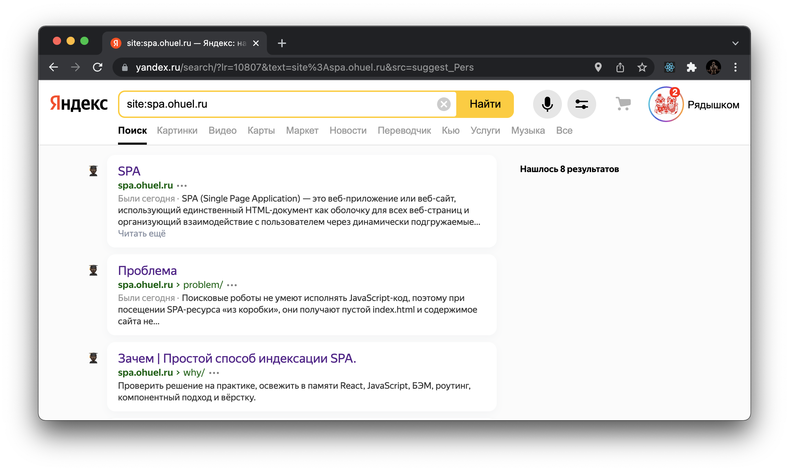

## Индексирование SPA на примере [spa.ohuel.ru](https://spa.ohuel.ru)

SPA (Single Page Application) — это веб-приложение или веб-сайт, использующий единственный HTML-документ как оболочку для всех веб-страниц и организующий взаимодействие с пользователем через динамически подгружаемые HTML, CSS, JavaScript.

### Проблема
Поисковые роботы не умеют исполнять JavaScript-код, поэтому при посещении SPA-ресурса «из коробки», они получают пустой index.html и содержимое сайта не индексируется.

### Задача
С минимальными изменениями в существующем проекте сделать так, чтобы поисковый робот индексировал все страницы SPA-приложения, а также установить для каждой страницы уникальные meta-теги (title, description, keywords ...etc).

### Планы на сайт

- [x] Дождаться индексирования в Yandex
- [ ] Дождаться индексирования в Google
- [ ] Добавить вложенные маршруты
- [x] Добавить тёмную тему
- [x] Добавить английскую версию
- [x] Реализовать перевод всех компонентов, используя контекст
- [x] Добавить форму обратной связи
- [x] Реализовать валидацию на стороне пользователя
- [x] Реализовать отправку писем

### На что обратить внимание

#### Динамические meta, включая favicon
Помимо стандартных уникальных meta, для каждой страницы устанавливается уникальная иконка. Изображение зависит от контента страницы и от применяемой темы (тёмная или светлая)

#### Динамическая тёмная тема
Тёмная тема сайта автоматически подстраивается под системные настройки.

#### SEO friendly 
Попробуйте поделиться ссылкой на сайт и его внутренние страницы в телеграм, vk, твиттер etc. В зависимости от того, какие meta допускаются в соц. сети, будут подгружены превью, заголовки, описания, адрес и название сайта.  

#### Страница 404
При переходе на несуществующий url любой вложенности, показывается страница 404, которая имеет те же динамические параметры, что и остальные страницы.

#### Динамическая английская версия
Сайт распознаёт язык, установленный у пользователя и автоматически подстраивается под него. Так как вариантов перевода реализовано всего два (ru, en), а значений локалей только одного английского языка около 20, если язык пользователя не русский и отличается от английского, по умолчанию для такого пользователя будет установлена английская локализация.

## Выводы по индексированию [ дополняются ]

Так как с октября 2021 Яндекс поддерживает [IndexNow](https://www.indexnow.org) (кто не в курсе, обязательно изучите - киллер фича, если бложите), сайт вывалился в индекс мгновенно, за исключением favicon и изображений. 

По дефолту png и прочее после сборки кодируется в Base64. В таком формате робот Яндекса пути к файлам не понимает (подтвержденно саппортом Вебмастера), поэтому пришлось настроить отображение человеческих путей для всего, что должно проиндексироваться.

Favicon редко появляется в поисковой выдаче раньше 14 дней, с момента первого визита роботов. В этот раз по срокам было примерно также (и IndexNow не помог, хотя изменения мета и заголовков обновляет в течение часа).  

Несмотря на то, что для каждой страницы установлен и сохранён в статике уникальный favicon, Яндекс воткнул на всю выдачу иконку с первой страницы. Посмотрим, как будет у Google.

Заголовки отображаются по собственной логике Яндекса. Где-то есть название сайта, где-то нет, хотя в статике всё одинаково, а длины по количеству символов хватает. 

Для Яндекса цель достигнута, все страницы SPA проиндексировались и попали в поиск. Картинки со страниц появятся в выдаче сильно позднее. 

Google за 2 недели не увидел ни одной страницы, несмотря на принудительные запросы на индексацию. В целом, это норма и для статичных сайтов в зоне ru.

...